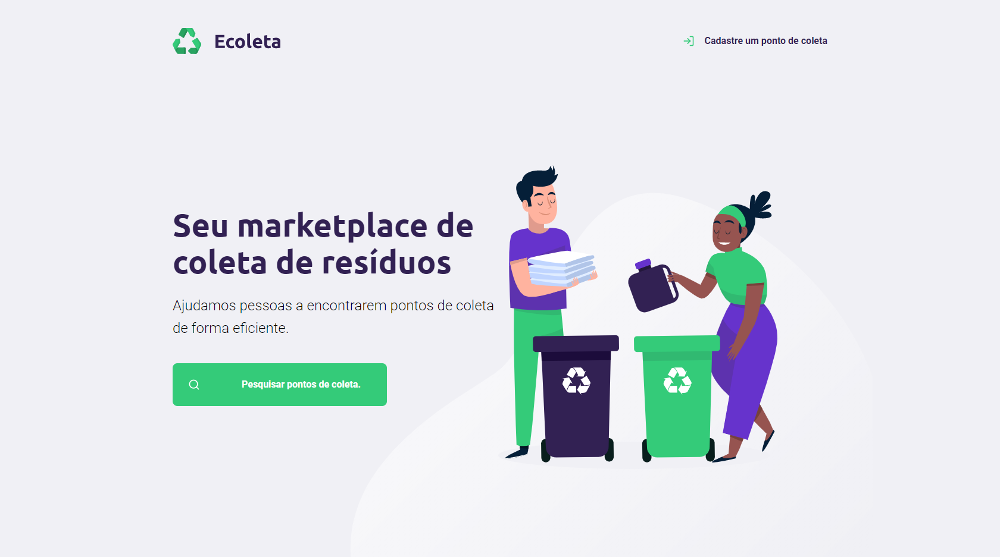
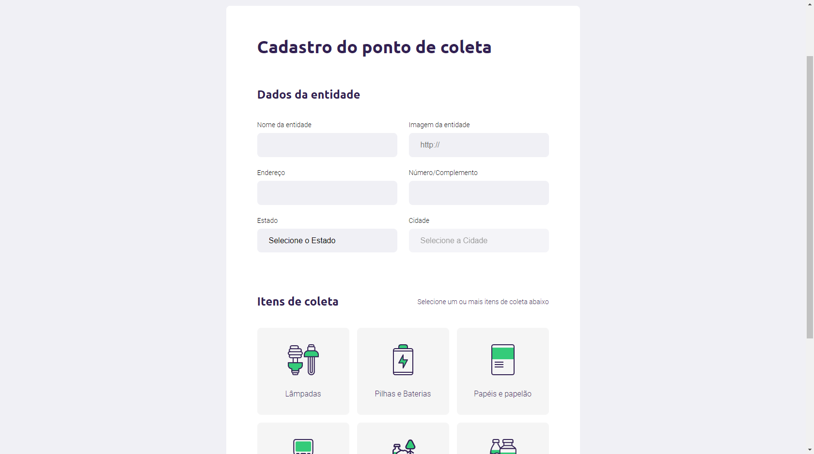
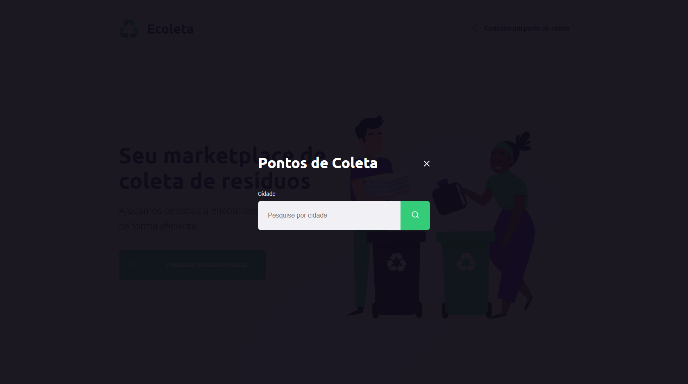

# 
 ♻️ Ecoleta 

<h1 align="center">
    
</h1>

# 
 NextLevelWeek 1.0 🚀 [Rocketseat](https://rocketseat.com.br/) 

## 📑 About 

The project aims to establish a connection between companies or entities that collect waste (organic and inorganic) to people or entities that constantly need to dispose of this waste. Solving a major recurring problem that is the inappropriate disposal of garbage, facilitating the process of recycling and reuse.

## 🧰 Technology 

The development tools used in this project were

- [JavaScript](https://developer.mozilla.org/pt-BR/docs/Web/JavaScript)
- [Node.js](https://nodejs.org/en/)
- [Nunjucks](https://mozilla.github.io/nunjucks/)
- [SQLite](https://github.com/mapbox/node-sqlite3)

## 🎨 Layout

**[Figma](https://www.figma.com/file/Byw4X5etg8VCmezueyhzkC/Ecoleta-(Starter)?node-id=136%3A1026)**

**Ecoleta** ♻️

---

**Create a collection point** 🖊️

---

**Search collection points** 🔎

---

## 📜 License 

Released in 2020. This project is under the [MIT license](LICENSE).

## Made with love by Leonardo Campello 💚 